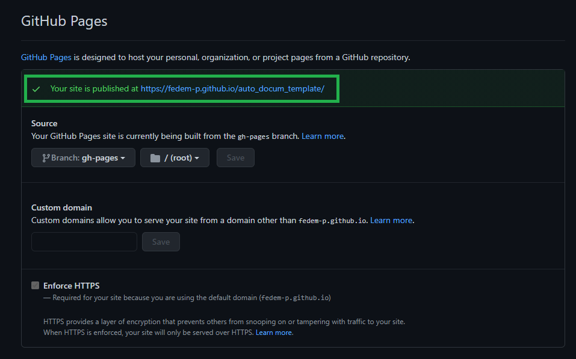

# A template to build documentation from any python code automatically
The aim of this [repository](https://github.com/fedem-p/my_documentation_template) is to showcase a simple implementation of automatically generated documentation which uses jupyter-books (build) and github pages (deploy).
-> like this [one](https://fedem-p.github.io/my_documentation_template/)

## Mind Map
1. create a repository
2. add documentation files in markdown in a specified folder
3. configure the documentation index and content 
4. add a makefile for building the documentation
5. set github actions to deploy the documentation
6. test the documentation so far (without autogenerated reference to the code)
7. add python code and modules
8. make the code pip install-able
9. update makefile and api reference

# Getting started

## 1 - Create a repository
create a repository or go to the repository you want to add documentation.
___

## 2 - Add documentation
* Create a folder in your repository called `/docs` where you'll host your documentation.
* Add in the `/docs` folder the markdown files for your documentation
* Create a `_toc.yml` file to setup your documentation table of content (see a more in depth guide [here](https://jupyterbook.org/customize/toc.html))\
as an example here's some code:

    ```YAML
        - file: index
            numbered: true

            - part: Introduction
            chapters:
            - file: intro/intro1
            - file: intro/intro2

            - part: Core Code
            chapters:
            - file: core/main1
            - file: core/main2

            - part: API
            chapters:
            - file: api/index 
    ```
    You can skip the manual setup of the _toc.yml file by running the following code:
            
            jupyter-book toc ./docs
            
    and then modify the structure to your taste
* add a `requirements.txt` file ( inside `/docs`) with the following dependencies:
    ```
        jupyter-book
        jupytext
        sphinx_autodoc_typehints
    ```

* create a folder `/api` inside `/docs` and create (inside) a file `index.rst`:
    ```
        .. _api:

        API Reference
        =============

        Information on specific functions, classes, and methods.


        Modules
        -------

        For the average user's workflows.

        .. autosummary::
        :toctree:
        :recursive:

        numpy.sum
    ```
    where `numpy.sum` is just to show a working implementation. 
___
## 3 - Configure the documentation
* Create a `_config.yml` file where to setup your page configuration (see a more in depth guide [here](https://jupyterbook.org/customize/config.html))\
It's important to insert the right extension in order to build the documentation correctly, here's an example:
    ```YAML
        sphinx:
            extra_extensions:
                - sphinx.ext.viewcode
                - sphinx.ext.napoleon
                - sphinx.ext.autodoc
                - sphinx_autodoc_typehints
                - sphinx.ext.autosummary
                - sphinx.ext.intersphinx

        config:
            autosummary_generate: True
            autosummary_imported_members: True
            intersphinx_mapping:
                python:
                    - "https://docs.python.org/3"
                    - null
                numpy:
                    - "https://docs.scipy.org/doc/numpy/"
                    - null
    ```
    where `intersphinx_mapping` allows the build to get the documentation online for the specified packages (i.e. `numpy`).

___
## 4 - Build the documentation
* Write a make file to build the documentation:
    ```YAML
        .PHONY: docs

        docs:
            rm -rf docs/_build/html
            find docs/api ! -name 'index.rst' -type f -exec rm -f {} +
            pip install -qr docs/requirements.txt
            jb build docs
    ```
___
## 5 - Add Github action for deployment
At this point the structure of the folder is ready to go, we can then move on to setup an action which will build and upload the documentation automatically.
*  Create a `.github/workflows/` folder 
* Add in the folder a `.yml` file for your action:
    ```YAML
        name: page_deploy

        on: push
        # Trigger the workflow on push or pull request,
        # but only for the main branch
        # push:
        #   branches:
        #     - main

        jobs:
        deploy-book:
            runs-on: ubuntu-latest
            steps:
            - uses: actions/checkout@v2

            # Install dependencies
            - name: Set up Python
            uses: actions/setup-python@v1
            with:
                python-version: "3.8"

            - name: Install dependencies
            run: |
                python -m pip install --upgrade pip
                pip install -r requirements.txt
            # Build the book
            - name: Build the book
            run: |
                make docs
            # Push the book's HTML to github-pages
            - name: GitHub Pages action
            uses: peaceiris/actions-gh-pages@v3.6.1
            with:
                github_token: ${{ secrets.ACCESS_TOKEN }}
                publish_dir: ./docs/_build/html
                
    ```

* To reuse this code you may need to change a couple of lines:
    * if your docs files are in the source folder as suggested in this guide you don't have to change the path for the build and publish. If this is not the case you need to change the folling lines:
        ```YAML
            #change with the path to your files
            run: |
                jupyter-book build ./docs 
        ```
        ```YAML
            #change with the path to your files
                publish_dir: ./docs/_build/html
        ```
    * you also need to change the `ACCESS_TOKEN` with the one specific to your repo (see more about github secrets [here](https://docs.github.com/en/actions/reference/encrypted-secrets))

* If you decide to reuse this code, remember also to add a `requirements.txt` in the main repository for the dependencies of your code.
___
## 6 - Test the progress so far
Note: you don't need to initiate `gh-pages` branch or abilitate your repo.
* Commit and push the changes, check in the settings of your github repository if the link to your documentation has been activated correcly
* check the github actions section of your repository and check whether there's any fail

* If everything went smoothly, then go to the settings and scroll down to github pages -> click on the link and see if your documentation is up


___
## 7 - Add python code and modules
* create another folder to hold the code of your package and make sure you insert an `__init__.py` file for each module.
* to get better autogenerated descriptions of your code add docstrings for each function and suggest the appropriate type for the inpute variables in this way:
    ```py
        def difference(a: int, b: int):
            """
            Subtracts two integers
            """
            return a-b
    ```
___
## 8 - Install the code
* to make the code intall-able we need to create a `setup.py` file in the main repository:
    ```py
        setup(
            name='myproject',
            description='a template for making documentation',
            long_description=long_description,
            long_description_content_type='text/markdown',
            version='0.2',
            author='your name',
            author_email='youremail',
            url='https://github.com/fedem-p/my_documentation_template',
            packages=find_packages(),
            include_package_data=True,
            python_requires=">=3.7",
            license='MIT',
            zip_safe=False,
            entry_points={
                'console_scripts': ['myproject=myproject.entry_points:main'],
            },
            classifiers=[
                'Intended Audience :: Developers',
                'Programming Language :: Python :: 3.7',
                'Natural Language :: English',
            ],
            keywords='auto documentation'
        )
    ```
    for a more in-depth guide check this [documentation](https://packaging.python.org/tutorials/packaging-projects/)

* Now test your code by running

                pip install -e .

    from within the repository.
* if it install everything without errors you can further test that everything worked properly in this way:\
    * run python, import sys and run sys.path -> your repository should be in the list
    * run python, import your package and some modules -> if you get any errors you may need to check if the code runs properly
___
## 9 - Update building script
The last step is to update a couple of files:
* Change the make file in this way:
    ```YAML
        .PHONY: docs

        docs:
            rm -rf docs/_build/html
            find docs/api ! -name 'index.rst' -type f -exec rm -f {} +
            pip install -qr docs/requirements.txt
            pip install -r requirements.txt     ## new line
	        pip install -e .                    ## new line
            jb build docs
    ```
___
* add to the `index.rst` file the modules that you want to reference:
    ```
    For the average user's workflows.

        .. autosummary::
        :toctree:
        :recursive:

        numpy.sum
        myproject
        myproject.module
    ```
    for a great example of this you can check the napari [repository](https://github.com/napari/napari/tree/master/docs/api)


## 10 - Test your page
Finally you can commit your changes and see if your documentation gets build properly. 
Repeat the same steps as in section number 6 and navigate to the api page.
Check if there are the links to your modules and functions.


___
# Now you can add and modify your documentation and at any push it will be updated automatically!

